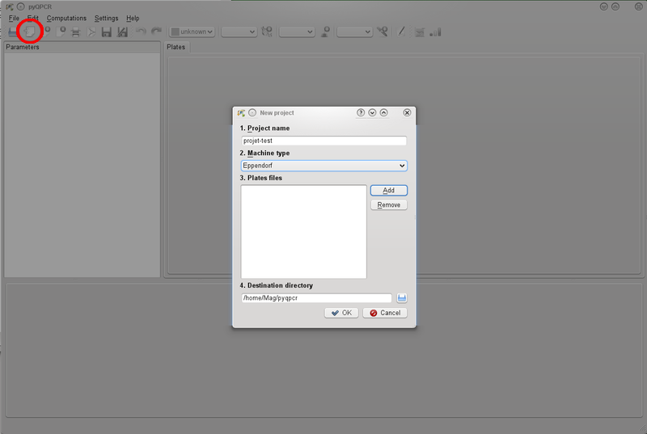
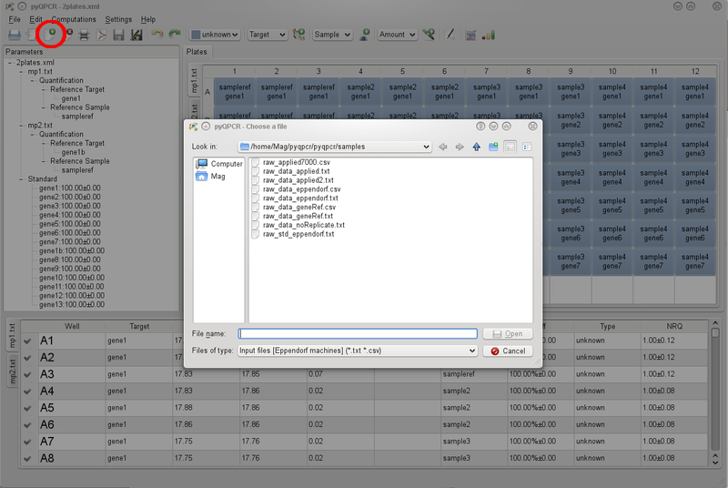
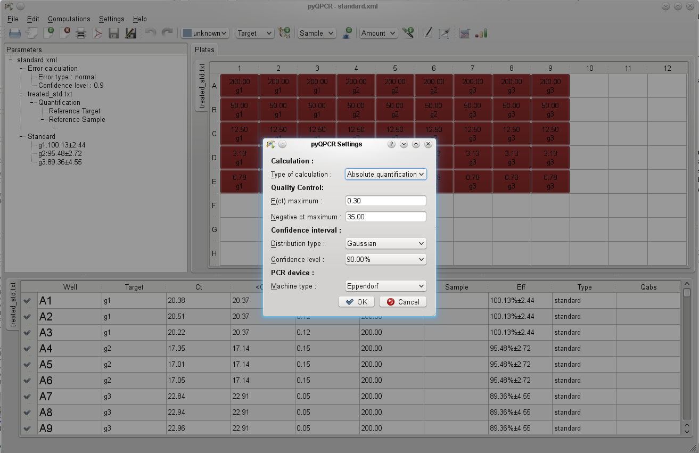
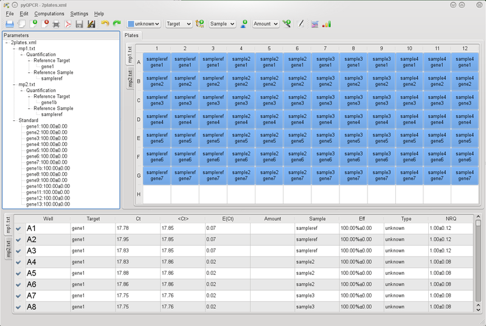
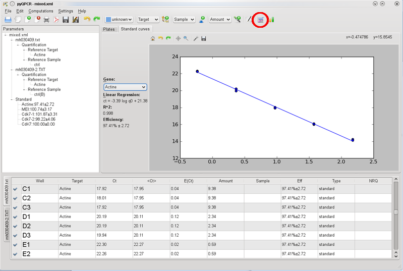
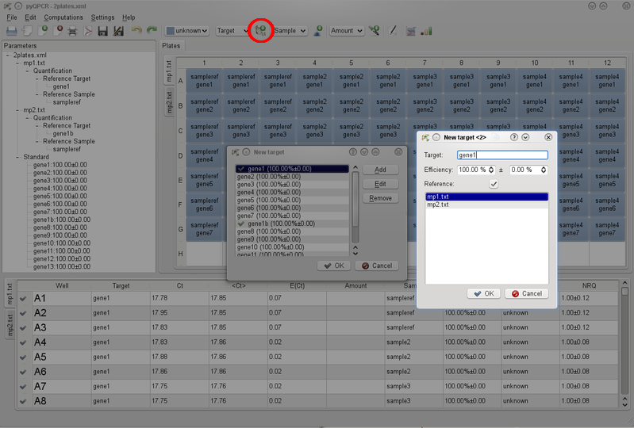
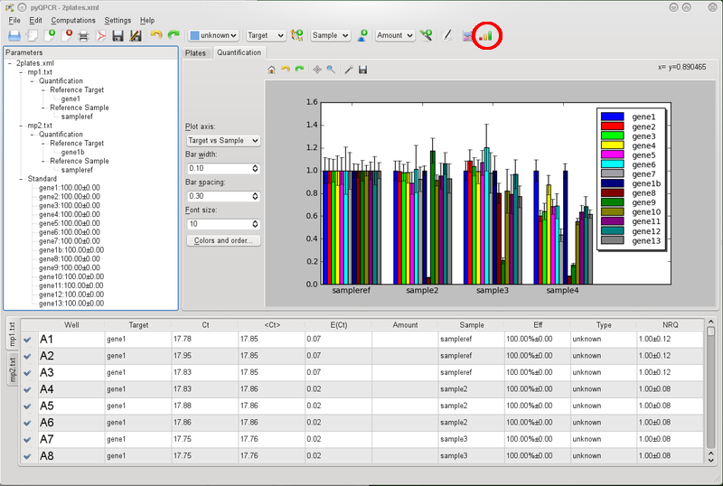
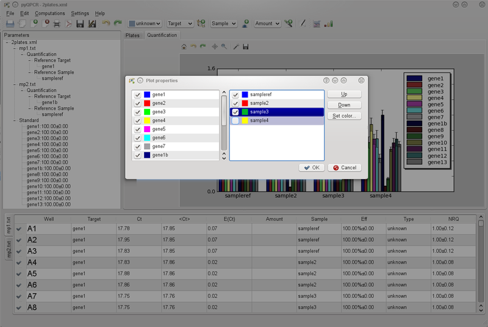
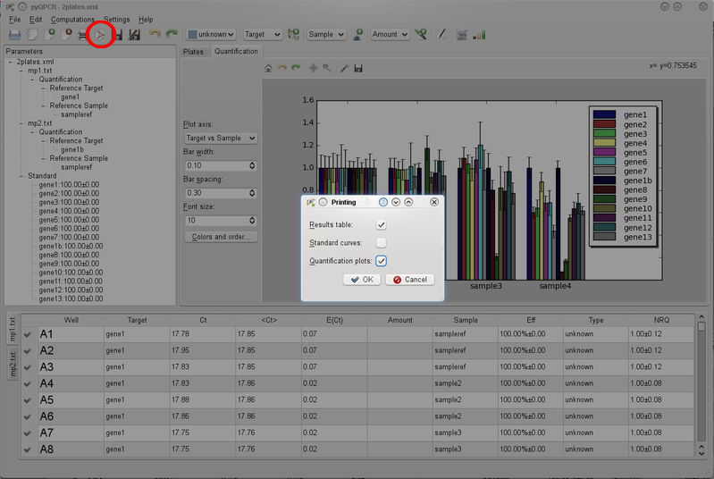
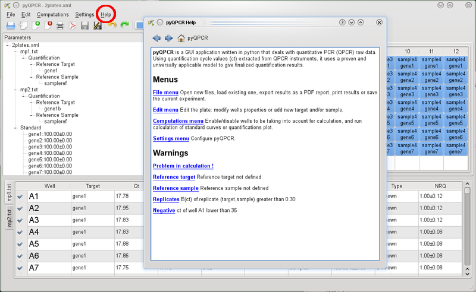

Quick start
***********

Import QPCR raw data / open existing file
=========================================

During this first step, you can:

* **Create a new project**: you give a project name, choose the PCR device (for now Eppendorf Realplex, AB7000, AB7500, AB StepOne, Roche LightCycler 480, Biorad MyIQ 2 and 5, Cepheid and Corbett Rotor Gene ones are supported, but others can be easily added) and import your raw data (TXT or CSV files) of one or several plates. Some examples of these files are given with the source of pyQPCR.
* **Open an existing one**: pyQPCR has its own file format which is XML based. You can directly open these files (examples are in the source code of pyQPCR).

At any time, you can add or remove a plate from your project thanks to the
corresponding icons. It is also possible to merge two different projects by
importing one project into another one. Finally you can extract subplates from
one plate. That is convenient if you share a plate with colleagues.

pyQPCR settings
===============

Different settings are available. First you can choose between relative or
absolute quantification. Relative quantification permits you to compare samples
to a reference sample. Absolute quantification gives quantifications thanks to
standard curves obtained from template dilutions. It is possible to modify
quality control parameters (maximum error of replicats and minimum ct of
negative controls). You can also select the way the errors are calculated and
which confidence level is used by the software. Finally, you can change the
quantitative PCR device to be in accordance with the one you use.

Plate settings
==============

You can edit the data of each well separately or select and modify a group of
wells. You also can change the targets and samples properties (name, efficiency
of the primers), and remove or add new ones. You can disable wells in order to
not take them into account for calculations.

Standard curve calculation
==========================

You can define as "standards" the wells that contains dilutions of matrix DNA in order
to calculate PCR efficiency. Then, you precise the amount of DNA (arbitrary
unit) in the different wells and the program will plot the standard curve and
calculate PCR efficiency for this set of primers. This efficiency will be taken
into account for subsequent relative or absolute quantifications.

Reference target and sample
===========================

For relative quantification calculations, you must define one or several
reference gene(s) and one reference sample. They can be either shared for all
plates or specific of each plate.

Relative quantification
=======================

The wells defined as "unknown" are used to calculate relative quantifications.
An improved :math:`\Delta\Delta Ct` method allows you to obtain reliable
quantifications and errors. The confidence level is modifiable and can be either
gaussian or calculated using a T-test.

The program plots results as histograms that are easy to customize (colors, 
legend, order, ...)

Absolute quantification
=======================

It is also possible to compute absolute quantification using standard curves.
Each replicate ct value will be converted into an amount of template by using
the standard curve corresponding to the appropriate gene.

Results, export and save
========================

Results can be printed or exported in a pdf file containing a table with all
the data and plots for standard curves and/or quantifications.

You can also save your project in the pyQPCR XML file format that allows you to
keep the entire project with the different plates and settings easily
recoverable.

Help
====

A Help menu is available and summarize the different functionalities of the
software.

